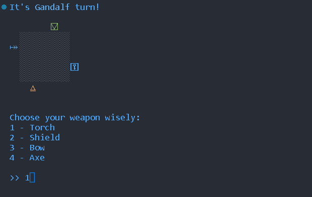
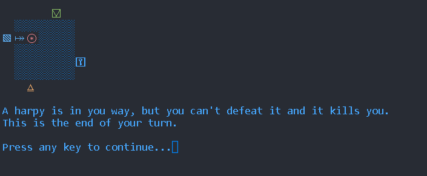

# CY Memory Game

## Summary

- [About](#about) Explain what the project is.
- [Content](#content) Explain what the project has as functionnality in the game.
- [Goal](#goal) Explain what is the goal to reach to win the game. 
- [Group](#group) The group that has made the project.
- [Files](#files) Explain where are the files and what are their goal.
- [Compile](#compile) Explain what you need to do to compile or clean the game.
- [Bugs](#bugs) A list, that we try to keep short, about the known bugs of this game.
- [Preview](#preview) Some screenshot of the game once it is running.
- [CY-Tech](#cy-tech) Our school icon, where the project comes from.

## About

This is a project for the CY TECH high school in Pre Ing 1 MIM 1. The directive are said in [this pdf file](./pr%C3%A9ING1_Projet_CY_Memory-RPG_v1.1.pdf). The group is in [group](#group).

## Content

The goal is to make a memory RPG, this is game with minimum 1 player and maximum 4. The player can choose to play a magician, a warrior, a thief or a ranger. Every turn, the player will have to choose a weapon betwenn, a torch, a schield, a bow and an axe. Each of these caracters have a goal, to find their artifacts (each one have one in particular, the magician is searching for the grimoire, ect...). The game itself is on a board game of 5x5. All the cases or hidden at the beginning, in these cases there is monsters, treasures, artifacts, a portal and a transmutation totem. The player will move blindly in the map. 

## Goal

To win the game, the player need to find the artifact of its caracter and a treasure.

## Group

Our group is composed of Hugo LÉON MÉRINO , Wiktor WOJTAN and Héloïse DEY.

## Files

In the folder [src](./src):
 
[main.c](./src/main.c) is the main file and the entry point. Game functions are in the [game.h](./src/game.h) and [game.c](./src/game.c) files. [save.h](./src/save.h) and [save.c](./src/save.c) are used to save the current game into a *memory.save* file. [menu.c](./src/menu.c) holds every functions used to make menu and menu animations. [sort.c](./src/sort.c) holds the sorting methods for the score display. 
[.gitignore](./.gitignore) and [.gitattributes](./.gitattributes) are files for the Github repository. All other files are declarations and platform compatibility functions.

In the folder [images](./images):

Just some images for this readme file.

In the folder [save](./save):

Upon playing, you will create saves files, that will be stocked in this folder. The [score.save](./save/score.save) is where player score are being saved. The [memory.save](./save/memory.save) is where the current game is being saved.

In the folder [bin](./bin):

This is where the compiled game will be outputed, under the name of [MemoryRPG.exe](./bin/MemoryRPG.exe) for Windows, and [MemoryRPG](./bin/MemoryRPG) for Linux. This folder is created upon compilation.

In the folder [obj](./obj):

This is where C files will be precompiled as Object files and stocked. This folder is created upon compilation.

## Compile

If you run [build.windows.bat](./build.windows.bat)/[build.linux.bat](./build.linux.sh) or [clean.windows.bat](./clean.windows.bat)/[clean.linux.sh](./clean.linux.sh), it will create/delete [bin](bin/) and [obj](obj/) directories. You need to be able to run makefile scripts to do so.

You can also run the makefiles alone, but the shell scripts is easier to do so.

Once it is done, head to the [bin folder](./bin/) and you will find the game executable. Run it as it is.

# Bugs

Here is a list of known bugs:
*Oh! No bugs known!*

We use a dynamic array for loading saves and scores. There is no limitation about their sizes. So if there are too many saves files, it can take quite a lot of RAM.

The number generated for the save ID are random, between 0 and 1 000 000. With bad luck, you can create the same number and override and old game.

## Preview

<!-- TODO ad a preview of the game -->

# CY Tech
